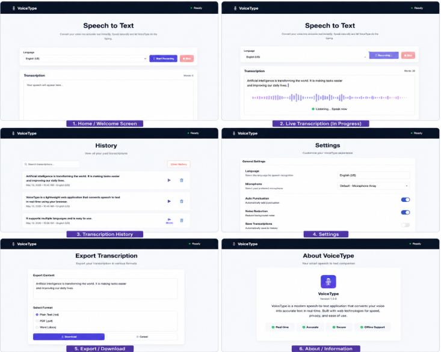
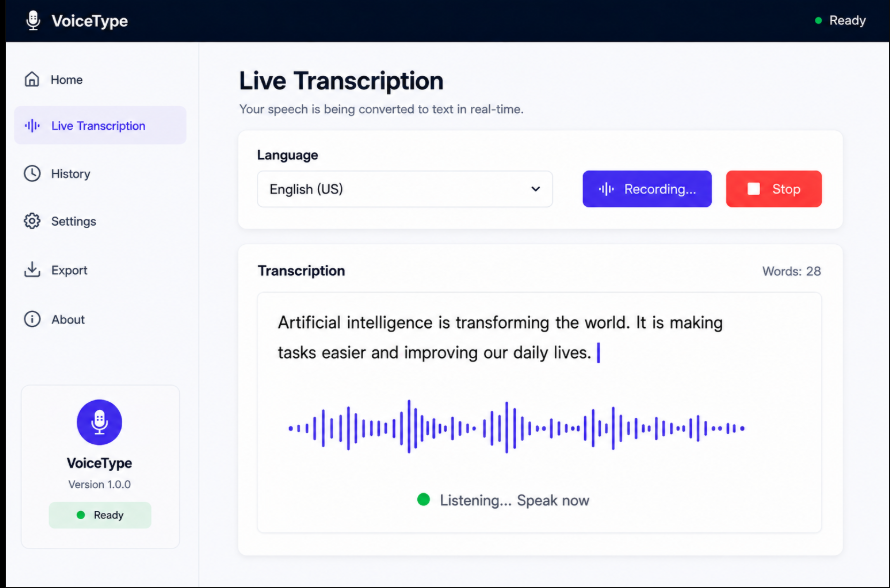
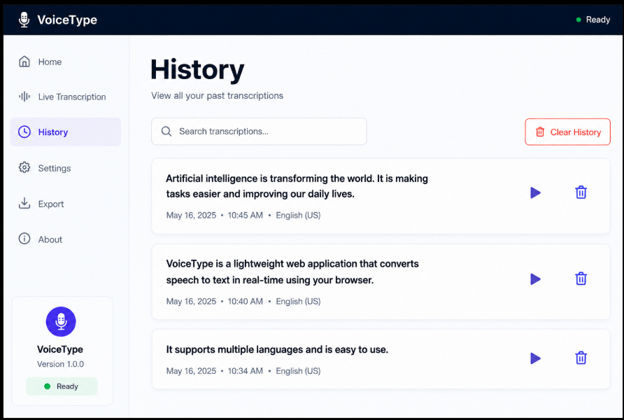
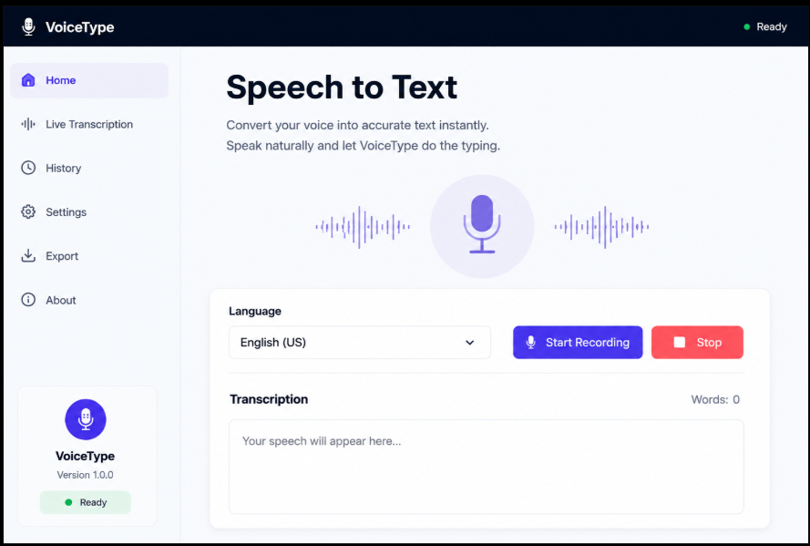
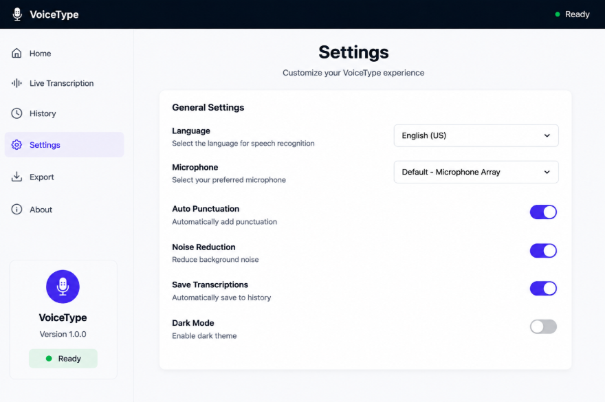
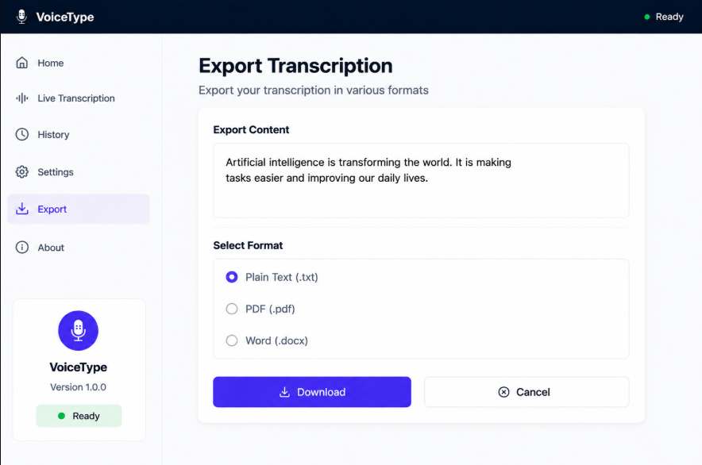
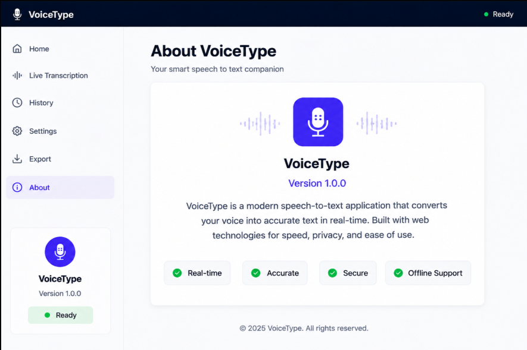

# 🎙️ Speech To Text System (VoiceType)

> A modern, real-time speech-to-text web application that converts spoken words into accurate text with multi-language support, word counting, and instant export capabilities.



---

## 🌟 Overview

**VoiceType** is a fast, responsive, and intuitive web-based speech recognition platform powered by modern Web APIs and custom CSS glassmorphism UI design. It allows users to convert continuous speech into text seamlessly in real-time, change recognition languages on the fly, track word counts dynamically, and copy or download transcriptions with one click.

---

## ✨ Features

- 🎤 **Real-Time Speech Recognition:** Instant voice-to-text conversion using the standard Web Speech API.
- 🌐 **Multi-Language Support:** Easily switch between **English (US)**, **English (UK)**, **Hindi**, **French**, **German**, and **Spanish**.
- 📊 **Dynamic Word Counter:** Real-time word count calculation as you speak or edit text.
- 📋 **One-Click Clipboard Copy:** Quick copy functionality for easy sharing and pasting.
- ⬇️ **Export & Download:** Save transcriptions directly as text (`.txt`) files.
- 🎨 **Modern Dark Aesthetic:** Responsive dark theme UI with sleek controls, status indicators, and smooth micro-animations.
- 🔒 **Privacy-First & Lightweight:** 100% client-side execution — no external server data storage.

---

## 📸 Screenshots

| Live Transcription | History View |
| :---: | :---: |
|  |  |

| Home Overview | App Settings |
| :---: | :---: |
|  |  |

| Export & Save | About Page |
| :---: | :---: |
|  |  |

---

## 🛠️ Tech Stack

- **Frontend:** HTML5, CSS3 (Modern Flexbox/Grid, Dark Theme), Vanilla JavaScript (ES6+)
- **API:** Web Speech API (`SpeechRecognition` / `webkitSpeechRecognition`)
- **Icons:** Emoji & SVG indicators

---

## 🚀 Getting Started

### Prerequisites

All you need is a modern web browser that supports the Web Speech API (e.g., **Google Chrome**, **Microsoft Edge**, **Brave**, **Safari**).

### Installation & Local Setup

1. **Clone the Repository:**
   ```bash
   git clone https://github.com/Dheeraj261708/speech-to-text-system.git
   cd speech-to-text-system
   ```

2. **Run locally:**
   Simply open `index.html` in your favorite web browser or serve it using Live Server / any HTTP server:
   ```bash
   npx serve .
   ```

---

## 📂 Project Structure

```
speech-to-text-system/
├── index.html              # Main HTML markup and UI layout
├── style.css               # Modern dark theme styles & layout rules
├── script.js               # Web Speech API integration & event listeners
├── .gitignore              # Git ignore configuration
├── README.md               # Project documentation
└── assets/
    └── screenshots/        # Application showcase images
        ├── Poster_image.png
        ├── Home.png
        ├── live_transcription.png
        ├── History.png
        ├── Export_Transcription.png
        ├── setting.png
        └── About.png
```

---

## 👨‍💻 Author

**Dheeraj Singh**
- GitHub: [@Dheeraj261708](https://github.com/Dheeraj261708)
- LinkedIn: [Dheeraj Singh](https://linkedin.com/in/dheeraj-singh-2230975d)
- Email: dheerajsingh2230975@gmail.com

---

## 📄 License

This project is open-source and available under the [MIT License](LICENSE).
